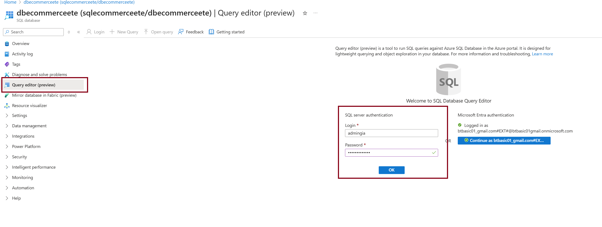
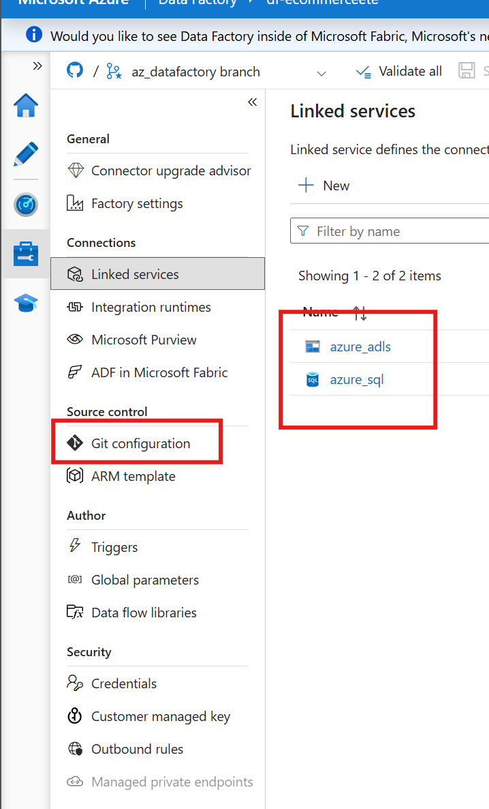
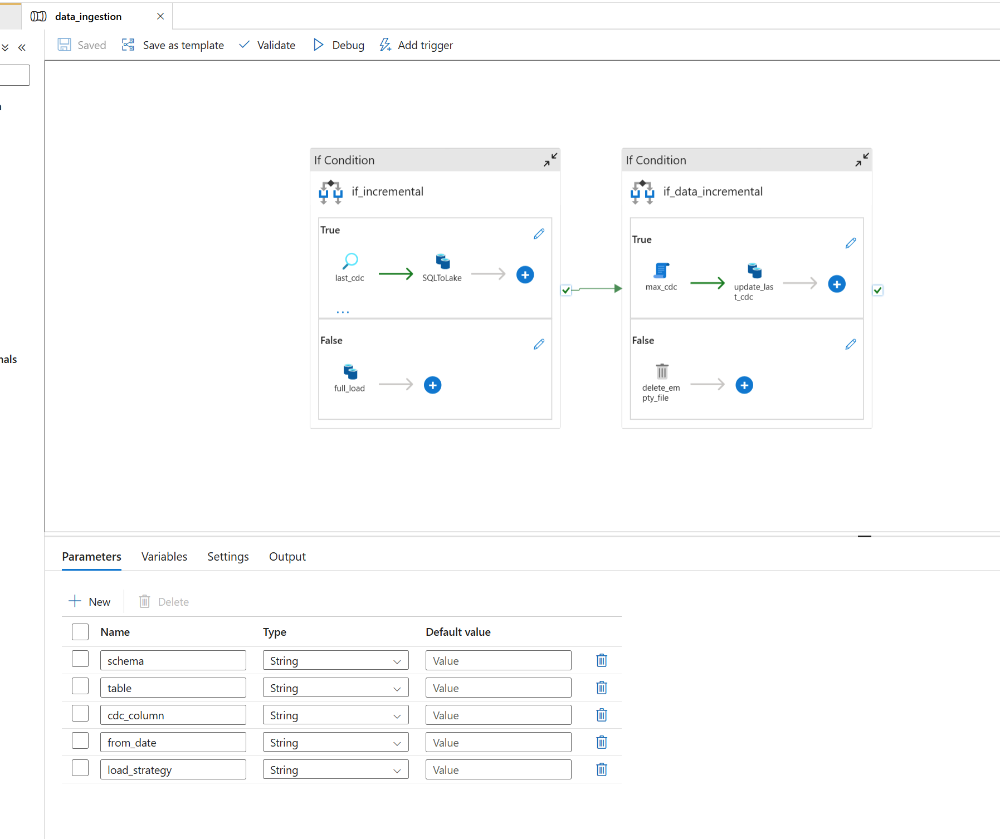
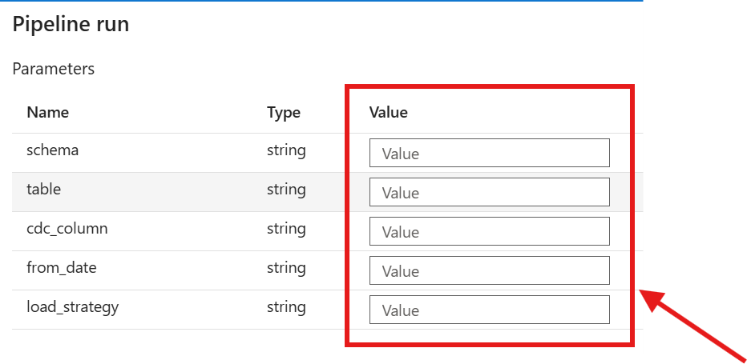
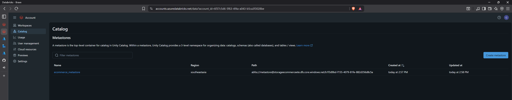
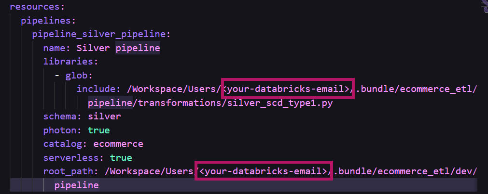
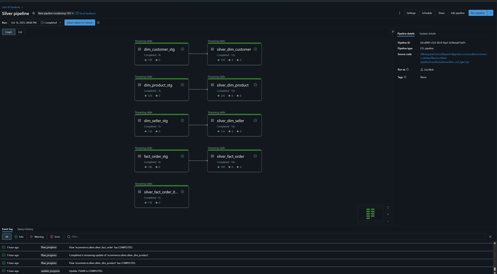

# Project Setup Guide

## Azure SQL Database Setup

Start by setting up your SQL database with initial data:

1. Open your SQL database in Azure Portal
2. Go to the Query Editor and log in with your credentials


3. Copy the SQL script from `cdc_test_data/ecommerce_initial_load.sql` and run it to load the initial dataset


## Azure Data Factory Configuration

Next, configure your data ingestion pipeline:

1. Set up the Data Factory using this repository (recommended), or import the pipeline manually


2. Create two Linked Services - one for Azure SQL and another for ADLS Gen2


3. Choose your ingestion approach:
   - Use `data_ingestion` pipeline to load specific tables
   - Use `ingest_all_table` pipeline to load everything at once

   
Both pipelines support incremental loading and process data dynamically.

## Azure Databricks Setup

### Initial Configuration

1. **Set up permissions**: In your resource group, navigate to the storage account IAM and assign the "Storage Blob Data Contributor" role to your Databricks connector (`databricks-ecommerceete-conn`)


2. **Create metastore**: Visit https://accounts.azuredatabricks.net/ and sign in with your Microsoft account. Create a metastore using your Databricks connector - this acts as a bridge between ADLS and Databricks. Assign your workspace to this metastore (remember: one metastore per region)


3. **User management**: Set up the necessary roles for your account (typically Admin)

### Workspace Configuration

4. Create your catalog and schemas (1 catalog with 2 schemas)
5. Set up an external credential using your Databricks connector for ADLS access

### Deployment

6. Deploy the Databricks asset bundle:
   ```bash
   databricks auth login
   databricks bundle deploy --target dev -p <your-profile>
   ```

7. Navigate to Resources and configure your pipeline settings


8. Your notebooks and pipeline will be available at: `Workspace/Users/<your-email>/.bundle/ecommerce_etl/dev/files/src`

### Running the Pipeline

9. Start by running `silver_dims.ipynb` to create dimension tables for Spark structured streaming
10. Execute `jinja_notebook.ipynb` to generate business and analytical views
11. Use the Lakeflow declarative pipeline for Spark structured streaming to implement SCD Type I and II
12. Check the incremental processing by using `cdc_test_data/ecommerce_incremental_load.sql`, follow the step from beggining.
